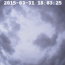

# ai-course-final-assignment

This was a project done during the course:
[Künstliche Intelligenz – Grundlagen und geographische Anwendungsbereiche](http://www.geographie.ruhr-uni-bochum.de/studium/modulfuehrer/wahlbereich-master/#c10272)

### image data from RGS II



## running the web app

`docker` and `docker-compose` need to be installed.

1. build the images:
   ```bash
   docker-compose build
   ```
1. start all containers
   ```bash
   docker-compose -f docker-compose.yml -f docker-compose.dev.yml upi
   ```
1. visit [`https://127.0.0.1:8080`](https://127.0.0.1:8080) in your browser

### upgrading requirements

```bash
pip-compile --allow-unsafe --generate-hashes --resolver=backtracking requirements.in
```
